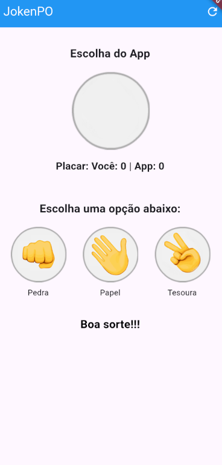

# JokenPo Flutter

JokenPo Flutter é um aplicativo desenvolvido em Flutter que simula o clássico jogo "Pedra, Papel ou Tesoura". O app possui uma interface intuitiva, animações suaves nas transições de imagens e texto, e uma contagem de pontos para acompanhar o desempenho do usuário versus o aplicativo.



## Instalação

### Pré-requisitos

- [Flutter SDK](https://flutter.dev/) instalado e configurado.
- Editor de código (ex.: [VS Code](https://code.visualstudio.com/) ou [Android Studio](https://developer.android.com/studio)).
- Dispositivo físico ou emulador configurado para execução de aplicativos Flutter.

### Passos para Instalação

1. **Clone o repositório:**

   ```bash
   git clone https://github.com/gabrielassed/dsdm1-jokenpo.git dsdm1_jokenpo
   ```

2. **Acesse o diretório do projeto:**

   ```bash
   cd dsdm1_jokenpo
   ```

3. **Instale as dependências:**

   ```bash
   flutter pub get
   ```

4. **Execute o aplicativo:**

   ```bash
   flutter run
   ```

## Como Usar

- Ao iniciar o aplicativo, a tela exibe uma imagem padrão e um placar zerado.
- Selecione uma opção (Pedra, Papel ou Tesoura) tocando na imagem correspondente.
- O aplicativo escolherá uma jogada aleatória, exibindo a imagem e o resultado (vitória, derrota ou empate) com uma animação de transição.
- O placar é atualizado automaticamente conforme o resultado da partida.
- Para reiniciar o jogo e zerar o placar, toque no botão de reset localizado na AppBar.

## Funcionalidades e Melhorias

1. Contagem de Pontos
2. Cores Indicativas no Resultado
3. Identificação das Opções
4. Animações de Transição 
5. Reset do Jogo

## Licença

Distribuído sob a licença MIT. Veja o arquivo [LICENSE](LICENSE) para mais detalhes.